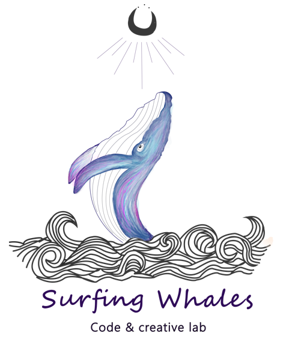
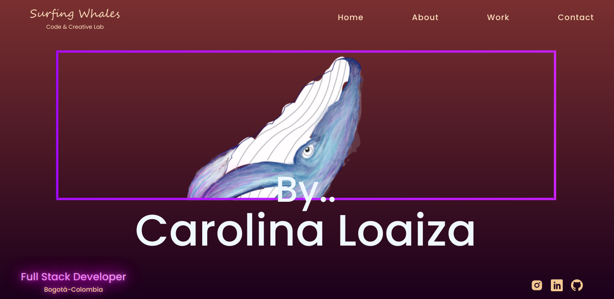
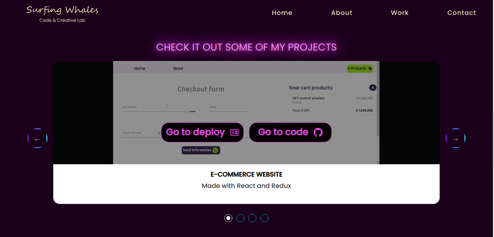
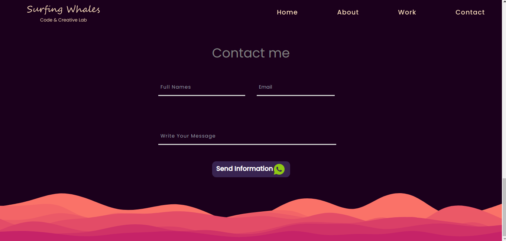

<h2 style="text-align:center; 
color: purple" >
My Portfolio"
</h2>

<h3 style="text-align:justify;"><strong>With this portfolio, i hope to let you know my skills and strengths, here you can see some of my projects and you can easily contact me.   !</strong></h3> 

This project was generated with 
* [Create React App](https://github.com/facebook/create-react-app).
  
* [React Icons](https://react-icons.github.io/react-icons/)
  
* [React Player](https://www.npmjs.com/package/react-player)
  
* [Slick Carousel](https://www.npmjs.com/search?q=slick-carousel)

* [Styled Components](https://styled-components.com/)

* [Tailwind](https://tailwindcss.com/)
  
  <h2 style="text-align:center;color: purple">Deploy</h2>
  *You can clone the public repository on: 

    [My Portfolio](https://github.com/carolo180/My-Portfolio)

     <h2 style="text-align:center;color: purple">Repository</h2>
  *You can clone the public repository on: 

    [My Portfolio](https://github.com/carolo180/My-Portfolio.git)
   
  * ### npm i or npm install: To install all dependices and libraries.

     

  *  ### npm start: Runs the app in the development mode to view it in your browser.
    
    

  <h2 style="text-align:center;color: purple">Landing Page</h2>         
               
 

On this page there is a dynamic navigation bar that allows easy navigation through the website, you will also find a social network section, and the animations make it more striking. 

<h2 style="text-align:center;color: purple">About</h2>         
               
 
Here you can find something about myself and also download my curriculum vitae.

  <h2 style="text-align:center;color: purple">Work</h2>         
               
 

On this page you can check for some of my cool projects. 

<h2 style="text-align:center;color: purple">Characters</h2>         
               
 
There is a contact form that sends the data directly to whatsapp .

